# CarbuCarbu

CarbuCarbu is a ride-sharing mobile application built with Expo, React Native, and Clerk for authentication. It allows users to sign in/up with email/password or Google OAuth, book rides, view ride history, and manage their profiles. The app features a sleek tab-based navigation system, Google Maps integration for ride booking, and a modern UI styled with Tailwind CSS via NativeWind.

This README provides a comprehensive guide to the project, including setup, project structure, API documentation, screenshots, and architectural diagrams (UML, data flow, system). It is designed for developers, contributors, and users to understand and interact with the CarbuCarbu application.

## Table of Contents

- [Project Overview](#project-overview)
- [Features](#features)
- [Project Structure](#project-structure)
- [Installation and Setup](#installation-and-setup)
- [Usage](#usage)
- [API Documentation](#api-documentation)
- [Screenshots](#screenshots)
- [Architecture and Diagrams](#architecture-and-diagrams)
  - [UML Diagrams](#uml-diagrams)
  - [Data Flow Diagrams](#data-flow-diagrams)
  - [System Diagrams](#system-diagrams)
- [Technologies Used](#technologies-used)
- [Contributing](#contributing)
- [Testing](#testing)
- [Troubleshooting](#troubleshooting)
- [Contact](#contact)

## Project Overview

CarbuCarbu is a mobile-first ride-sharing platform designed to connect users with drivers for easy transportation. Built with Expo and React Native, it leverages Clerk for secure authentication (email/password and Google OAuth), Expo Router for navigation, and Google Maps API for location-based ride booking. The app supports user profile management, ride history, and payment integration via Stripe. The UI is styled with Tailwind CSS (via NativeWind) in a neon purple aesthetic (`primary-100` #F5E6FF, `primary-500` #8A00C4, `primary-700` #6B008F, `primary-800` #550070, `shadow-primary-300` #CC99FF) using `PlusJakartaSans` fonts for a responsive and modern design.

The application is structured into authentication screens (sign-in, sign-up, welcome), tab-based navigation (home, rides, chat, profile), and ride-booking flows (find-ride, book-ride, confirm-ride). Backend APIs handle user management, ride creation, and payments.

## Features

- **Authentication**:
  - Sign in/up with email/password or Google OAuth using Clerk.
  - Email verification for secure sign-up.
  - Session management with secure token storage.
- **User Profile**:
  - Display user details (first name, last name, email, phone, profile image).
  - Secure logout functionality.
- **Ride Booking**:
  - Search for rides using Google Maps API.
  - Book and confirm rides with driver details.
  - View ride history.
- **Navigation**:
  - Tab-based navigation for Home, Rides, Chat, and Profile.
  - Bottom sheet interface for ride details.
- **Payments**:
  - Integration with Stripe for secure payments.
- **UI/UX**:
  - Modern design with Tailwind CSS.
  - Animated tab bar and bottom sheet interactions.
- **Error Handling**:
  - User-friendly error messages for network issues, authentication failures, and more.

## Project Structure

The project follows a modular structure with clear separation of concerns. Below is the directory tree:

```
.
├── .DS_Store
├── .eslintrc.js
├── .expo
│   ├── devices.json
│   ├── README.md
│   └── types
│       └── router.d.ts
├── .gitignore
├── .vscode
│   ├── .react
│   └── settings.json
├── app
│   ├── _layout.tsx
│   ├── (api)
│   │   ├── (stripe)
│   │   │   ├── create+api.ts
│   │   │   └── pay+api.ts
│   │   ├── driver+api.ts
│   │   ├── ride
│   │   │   ├── [id]+api.ts
│   │   │   └── create+api.ts
│   │   └── user+api.ts
│   ├── (auth)
│   │   ├── _layout.tsx
│   │   ├── sign-in.tsx
│   │   ├── sign-up.tsx
│   │   └── welcome.tsx
│   ├── (root)
│   │   ├── _layout.tsx
│   │   ├── (tabs)
│   │   │   ├── _layout.tsx
│   │   │   ├── chat.tsx
│   │   │   ├── home.tsx
│   │   │   ├── profile.tsx
│   │   │   └── rides.tsx
│   │   ├── book-ride.tsx
│   │   ├── confirm-ride.tsx
│   │   └── find-ride.tsx
│   ├── +html.tsx
│   ├── +not-found.tsx
│   └── index.tsx
├── app.json
├── assets
│   ├── fonts
│   │   ├── PlusJakartaSans-Bold.ttf
│   │   ├── PlusJakartaSans-BoldItalic.ttf
│   │   ├── PlusJakartaSans-ExtraBold.ttf
│   │   ├── PlusJakartaSans-ExtraLight.ttf
│   │   ├── PlusJakartaSans-Italic.ttf
│   │   ├── PlusJakartaSans-Light.ttf
│   │   ├── PlusJakartaSans-Medium.ttf
│   │   ├── PlusJakartaSans-Regular.ttf
│   │   ├── PlusJakartaSans-SemiBold.ttf
│   │   └── PlusJakartaSans-SemiBoldItalic.ttf
│   ├── icons
│   │   ├── arrow-down.png
│   │   ├── arrow-up.png
│   │   ├── back-arrow.png
│   │   ├── chat.png
│   │   ├── check.png
│   │   ├── close.png
│   │   ├── dollar.png
│   │   ├── email.png
│   │   ├── eyecross.png
│   │   ├── google.png
│   │   ├── home.png
│   │   ├── list.png
│   │   ├── lock.png
│   │   ├── map.png
│   │   ├── marker.png
│   │   ├── out.png
│   │   ├── person.png
│   │   ├── pin.png
│   │   ├── point.png
│   │   ├── profile.png
│   │   ├── search.png
│   │   ├── selected-marker.png
│   │   ├── star.png
│   │   ├── target.png
│   │   └── to.png
│   └── images
│       ├── adaptive-icon.png
│       ├── check.png
│       ├── favicon.png
│       ├── get-started.png
│       ├── icon.png
│       ├── message.png
│       ├── no-result.png
│       ├── onboarding1.png
│       ├── onboarding2.png
│       ├── onboarding3.gif
│       ├── onboarding3.png
│       ├── partial-react-logo.png
│       ├── react-logo.png
│       ├── signup-car.png
│        ├── splash.gif
│       └── splash.png
├── babel.config.js
├── components
│   ├── CustomButton.tsx
│   ├── DriverCard.tsx
│   ├── GoogleTextInput.tsx
│   ├── InputField.tsx
│   ├── Map.tsx
│   ├── OAuth.tsx
│   ├── Payment.tsx
│   ├── RideCard.tsx
│   └── RideLayout.tsx
├── constants
│   └── index.ts
├── docs
│   ├── diagrams
│   │   ├── auth-class-diagram.png
│   │   ├── auth-component-diagram.png
│   │   ├── dfd-auth.png
│   │   ├── dfd-level0.png
│   │   ├── signin-sequence.png
│   │   ├── signup-sequence.png
│   │   └── system-architecture.png
│   └── screenshots
│       ├── bookridescreen.png
│       ├── confirmridescreen.png
│       ├── findridescreen1.png
│       ├── findridescreen2.png
│       ├── homescreen2.png
│       ├── paymentscreen.png
│       ├── profilescreen.png
│       ├── ridesscreen.png
│       ├── selectridescreen1.png
│       ├── selectridescreen2.png
│       ├── signinscreen.png
│       ├── signupscreen.gif
│       ├── welcomescreen1.png
│       ├── welcomescreen2.png
│       ├── welcomescreen3.gif
│       └── welcomescreen3.png
├── eslint.config.js
├── expo-env.d.ts
├── lib
│   ├── auth.ts
│   ├── fetch.ts
│   ├── map.ts
│   └── utils.ts
├── nativewind-env.d.ts
├── package-lock.json
├── package.json
├── README.md
├── store
│   └── index.ts
├── tailwind.config.js
├── tree.txt
├── tsconfig.json
└── types
    ├── image.d.ts
    └── type.d.ts
```

### Key Directories and Files

- **app/**: Contains app routes and screens.
  - `(auth)/`: Authentication screens (`sign-in.tsx`, `sign-up.tsx`, `welcome.tsx`).
  - `(root)/(tabs)/`: Tab navigation screens (`home.tsx`, `rides.tsx`, `chat.tsx`, `profile.tsx`).
  - `(root)/`: Ride booking screens (`find-ride.tsx`, `book-ride.tsx`, `confirm-ride.tsx`).
  - `(api)/`: Backend API routes for user, ride, and payment management.
- **assets/**: Fonts, icons, and images for UI.
- **components/**: Reusable UI components (e.g., `CustomButton.tsx`, `Map.tsx`).
- **lib/**: Utility functions for authentication (`auth.ts`), API fetching (`fetch.ts`), and maps (`map.ts`).
- **constants/**: App-wide constants (`index.ts`).
- **store/**: State management (`index.ts`).
- **docs/**: Screenshots and diagrams for documentation.

## Installation and Setup

### Prerequisites

- Node.js: v18.x or higher
- npm: v9.x or higher
- Expo CLI: Install globally with `npm install -g expo-cli`
- Git: For cloning the repository
- Clerk Account: For authentication setup
- Google Maps API Key: For location services
- Stripe Account: For payment integration
- Neon Database: For user and ride data storage ([Neon Console](https://console.neon.tech))

### Steps

1. **Clone the Repository**:
   ```bash
   git clone https://github.com/oluwaseun-odufisan/CarbuCarbu.git
   cd CarbuCarbu
   ```

2. **Install Dependencies**:
   ```bash
   npm install
   ```

3. **Configure Environment Variables**:
   Create a `.env` file in the root directory:
   ```
   EXPO_PUBLIC_CLERK_PUBLISHABLE_KEY=your_clerk_publishable_key
   EXPO_PUBLIC_PLACES_API_KEY=your_google_places_api_key
   EXPO_PUBLIC_DIRECTIONS_API_KEY=your_google_directions_api_key
   EXPO_PUBLIC_STRIPE_PUBLISHABLE_KEY=your_stripe_publishable_key
   DATABASE_URL=your_neon_database_url
   ```
   - Obtain `your_clerk_publishable_key` from [Clerk Dashboard](https://dashboard.clerk.dev).
   - Obtain `your_google_maps_api_keys` from [Google Cloud Console](https://console.cloud.google.com).
   - Obtain `your_stripe_publishable_key` from [Stripe Dashboard](https://dashboard.stripe.com).
   - Obtain `your_neon_database_url` from [Neon Console](https://console.neon.tech).

4. **Update `app.json`**:
   Ensure `app.json` includes the Clerk plugin and correct asset paths:
   ```json
   "plugins": [
     ["@clerk/clerk-expo", { "publishableKey": "process.env.EXPO_PUBLIC_CLERK_PUBLISHABLE_KEY" }],
     "expo-router"
   ]
   ```

5. **Run the App**:
   ```bash
   npx expo start
   ```
   - For iOS: `npx expo start --ios`
   - For Android: `npx expo start --android`
   - For Web: `npx expo start --web`

6. **Build for Production** (optional):
   ```bash
   npx expo prebuild
   npx expo run:ios
   npx expo run:android
   ```

### Troubleshooting Setup

- **Clerk Errors**: Verify `EXPO_PUBLIC_CLERK_PUBLISHABLE_KEY` matches the Clerk dashboard.
- **Google Maps**: Ensure the API key is enabled for Maps SDK (iOS/Android).
- **Neon Database**: Verify `DATABASE_URL` in `.env` and ensure the `users` table schema:
  ```sql
  CREATE TABLE users (
    id SERIAL PRIMARY KEY,
    first_name VARCHAR(255) NOT NULL,
    last_name VARCHAR(255),
    email VARCHAR(255) NOT NULL,
    clerk_id VARCHAR(255) NOT NULL UNIQUE
  );
  ```
- **Dependencies**: If errors occur, run:
  ```bash
  npx expo install --fix
  ```

## Usage

- **Onboarding**:
  - View the onboarding screens (`assets/images/onboarding1.png`, `onboarding2.png`, `onboarding3.png`) in `welcome.tsx` to learn about the app.
- **Authentication**:
  - Sign in/up via `sign-in.tsx` or `sign-up.tsx` using email/password or Google OAuth.
  - Verify email during sign-up with a code sent to your email.
- **Navigation**:
  - Use the tab bar to navigate between Home, Rides, Chat, and Profile.
- **Ride Booking**:
  - Go to `find-ride.tsx`, search for a destination using Google Maps, select a driver, and book via `book-ride.tsx`.
  - Confirm the ride in `confirm-ride.tsx` with payment details.
- **Profile**:
  - View and manage your profile in `profile.tsx`.
  - Sign out securely.
- **Ride History**:
  - View past rides in `rides.tsx`.

## API Documentation

The app includes serverless API routes in `app/(api)/` for user management, ride creation, and payments, using Neon for database operations.

### Authentication

APIs require Clerk authentication tokens, passed via `Authorization: Bearer <token>` header. Tokens are managed by `lib/auth.ts` using Clerk’s `useAuth` and `expo-secure-store`.

**Example Usage**:
```bash
curl -X POST https://your-api-base-url/api/user \
  -H "Authorization: Bearer $(node -e "require('expo-secure-store').getItem('clerk_token')")" \
  -H "Content-Type: application/json" \
  -d '{"first_name":"Oluwaseun","last_name":"Isaac","email":"isaac@example.com","clerkId":"user_123"}'
```

### Endpoints

1. **User API** (`app/(api)/user+api.ts`)

   - **POST /api/user**:
     - **Description**: Create a new user in the backend after Clerk sign-up.
     - **Request Body**:
       ```json
       {
         "first_name": "string", // Required
         "last_name": "string | null", // Optional
         "email": "string", // Required
         "clerkId": "string" // Required
       }
       ```
     - **Response**:
       - `201`: `{ "data": { "rowCount": 1 } }`
       - `400`: `{ "error": "Missing required fields: first_name, email, and clerkId are required" }`
       - `500`: `{ "error": "Internal Server Error" }`
     - **Example**:
       ```bash
       curl -X POST https://your-api-base-url/api/user \
         -H "Authorization: Bearer <token>" \
         -H "Content-Type: application/json" \
         -d '{"first_name":"Oluwaseun","last_name":"Odufisan","email":"example@gmail.com","clerkId":"user_123"}'
       ```

2. **Ride API** (`app/(api)/ride/[id]+api.ts`, `app/(api)/ride/create+api.ts`)

   - **GET /api/ride/[id]**:
     - **Description**: Fetch ride details by ID.
     - **Parameters**: `id` (path parameter, string)
     - **Response**:
       - `200`:
         ```json
         {
           "id": "string",
           "userId": "string",
           "driverId": "string",
           "origin": { "lat": number, "lng": number },
           "destination": { "lat": number, "lng": number },
           "status": "pending | confirmed | completed | cancelled",
           "price": number
         }
         ```
       - `404`: `{ "error": "Ride not found" }`
       - `500`: `{ "error": "Internal Server Error" }`
     - **Example**:
       ```bash
       curl -X GET https://your-api-base-url/api/ride/ride_123 \
         -H "Authorization: Bearer <token>"
       ```

   - **POST /api/ride/create**:
     - **Description**: Create a new ride.
     - **Request Body**:
       ```json
       {
         "userId": "string", // Required
         "driverId": "string", // Required
         "origin": { "lat": number, "lng": number }, // Required
         "destination": { "lat": number, "lng": number }, // Required
         "price": number // Required
       }
       ```
     - **Response**:
       - `201`: `{ "message": "Ride created", "rideId": "string" }`
       - `400`: `{ "error": "Invalid input: missing required fields" }`
       - `500`: `{ "error": "Internal Server Error" }`
     - **Example**:
       ```bash
       curl -X POST https://your-api-base-url/api/ride/create \
         -H "Authorization: Bearer <token>" \
         -H "Content-Type: application/json" \
         -d '{"userId":"user_123","driverId":"driver_456","origin":{"lat":37.7749,"lng":-122.4194},"destination":{"lat":37.7849,"lng":-122.4294},"price":25.50}'
       ```

3. **Driver API** (`app/(api)/driver+api.ts`)

   - **GET /api/driver**:
     - **Description**: Fetch available drivers.
     - **Response**:
       - `200`:
         ```json
         [
           {
             "id": "string",
             "name": "string",
             "location": { "lat": number, "lng": number },
             "rating": number
           }
         ]
         ```
       - `500`: `{ "error": "Internal Server Error" }`
     - **Example**:
       ```bash
       curl -X GET https://your-api-base-url/api/driver \
         -H "Authorization: Bearer <token>"
       ```

4. **Stripe Payment API** (`app/(api)/(stripe)/create+api.ts`, `app/(api)/(stripe)/pay+api.ts`)

   - **POST /api/stripe/create**:
     - **Description**: Create a Stripe payment intent.
     - **Request Body**:
       ```json
       {
         "amount": number, // Required, in cents
         "currency": "string" // Required, e.g., "usd"
       }
       ```
     - **Response**:
       - `200`: `{ "clientSecret": "string" }`
       - `400`: `{ "error": "Invalid amount or currency" }`
       - `500`: `{ "error": "Internal Server Error" }`
     - **Example**:
       ```bash
       curl -X POST https://your-api-base-url/api/stripe/create \
         -H "Authorization: Bearer <token>" \
         -H "Content-Type: application/json" \
         -d '{"amount":2550,"currency":"usd"}'
       ```

   - **POST /api/stripe/pay**:
     - **Description**: Process a payment.
     - **Request Body**:
       ```json
       {
         "paymentIntentId": "string" // Required
       }
       ```
     - **Response**:
       - `200`: `{ "message": "Payment successful" }`
       - `400`: `{ "error": "Payment failed: invalid paymentIntentId" }`
       - `500`: `{ "error": "Internal Server Error" }`
     - **Example**:
       ```bash
       curl -X POST https://your-api-base-url/api/stripe/pay \
         -H "Authorization: Bearer <token>" \
         -H "Content-Type: application/json" \
         -d '{"paymentIntentId":"pi_123"}'
       ```

## Screenshots

Below are screenshots of the application’s key screens, grouped where applicable to display related screens side by side.

- **Welcome Screens** (`app/(auth)/welcome.tsx`):
  - Description: Displays the app’s introduction with a “Get Started” button.
  - Screenshots:
    <table>
      <tr>
        <td>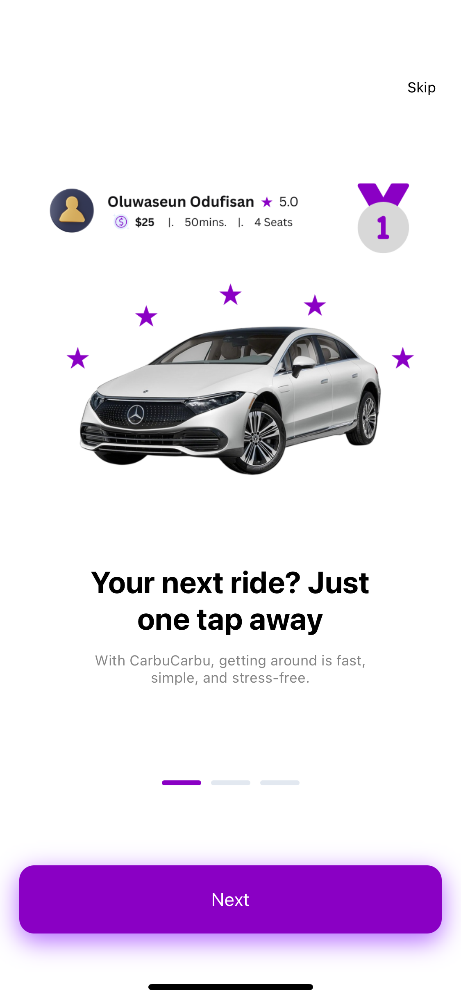</td>
        <td>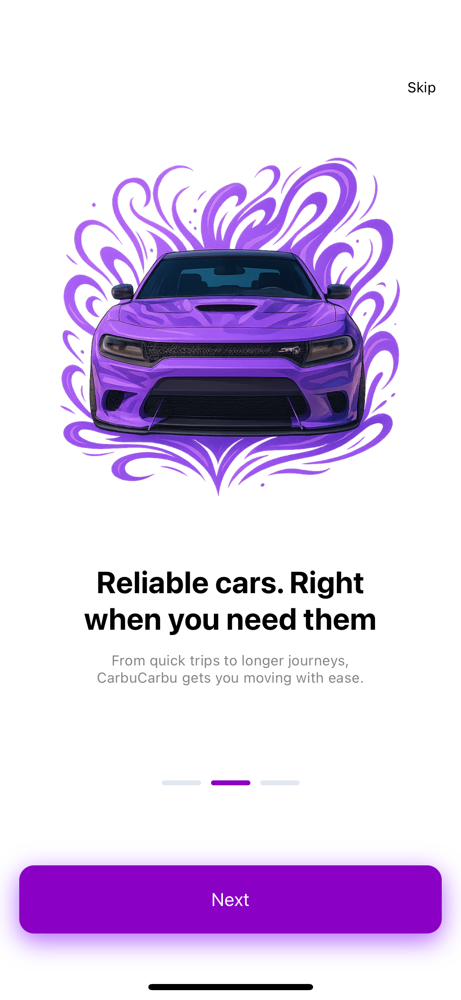</td>
        <td>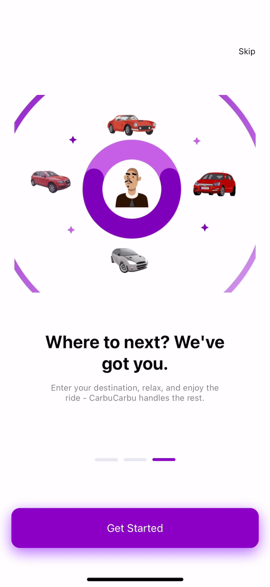</td>
      </tr>
      <tr>
        <td align="center">Welcome Screen 1</td>
        <td align="center">Welcome Screen 2</td>
        <td align="center">Welcome Screen 3</td>
      </tr>
    </table>
    
- **Sign-In Screen** (`app/(auth)/sign-in.tsx`):
  - Description: Allows email/password or Google OAuth sign-in with a loading indicator.
  - Screenshot:
    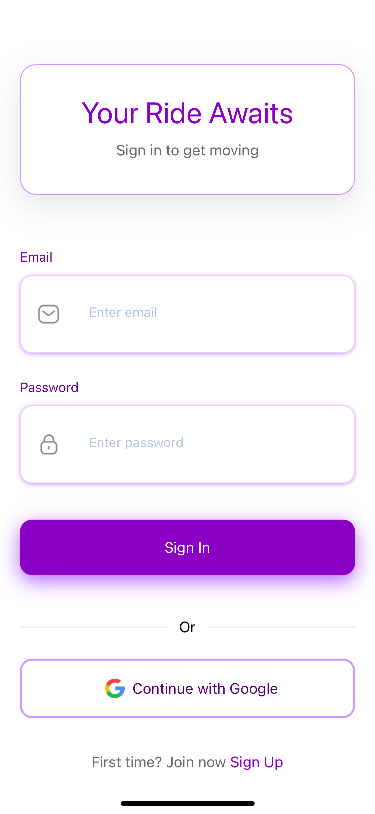

- **Sign-Up Screen** (`app/(auth)/sign-up.tsx`):
  - Description: Supports first name, last name (optional), email, password sign-up with email verification modal.
  - Screenshot:
    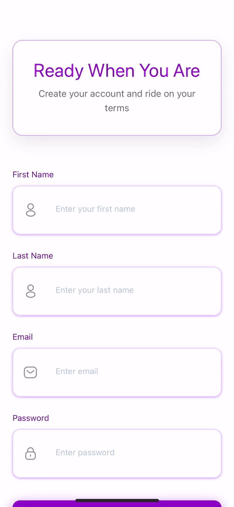

- **Home Screen** (`app/(root)/(tabs)/home.tsx`):
  - Description: Main dashboard with ride search and recent activity.
  - Screenshot:
    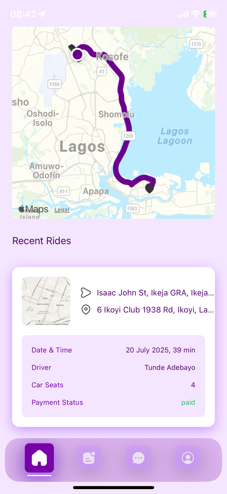

- **Rides Screen** (`app/(root)/(tabs)/rides.tsx`):
  - Description: Lists past and upcoming rides.
  - Screenshot:
    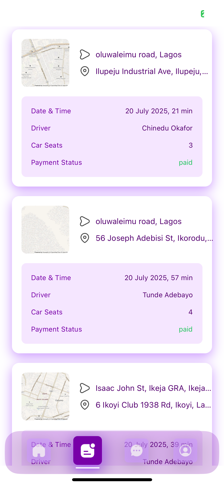

- **Chat Screen** (`app/(root)/(tabs)/chat.tsx`):
  - Description: Messaging interface for driver-user communication.
 - Screenshot:
    

- **Profile Screen** (`app/(root)/(tabs)/profile.tsx`):
  - Description: Displays user details (first name, last name, email, phone, image) and logout button.
  - Screenshot:
    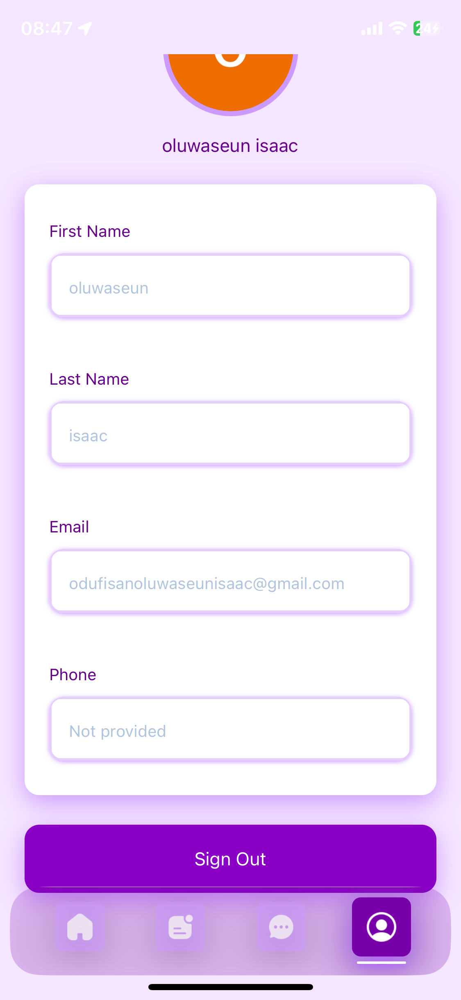

- **Find Ride Screens** (`app/(root)/find-ride.tsx`):
  - Description: Google Maps interface for selecting ride origin/destination.
  - Screenshots:
    <table>
      <tr>
        <td>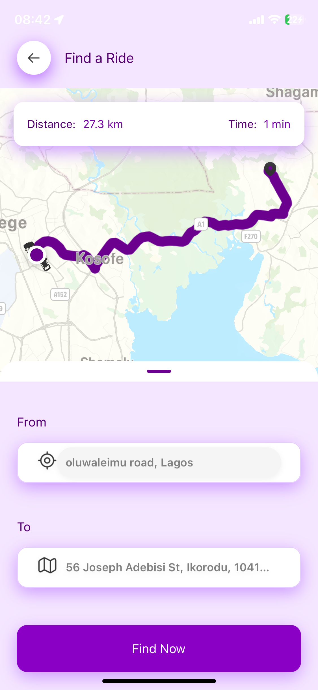</td>
        <td>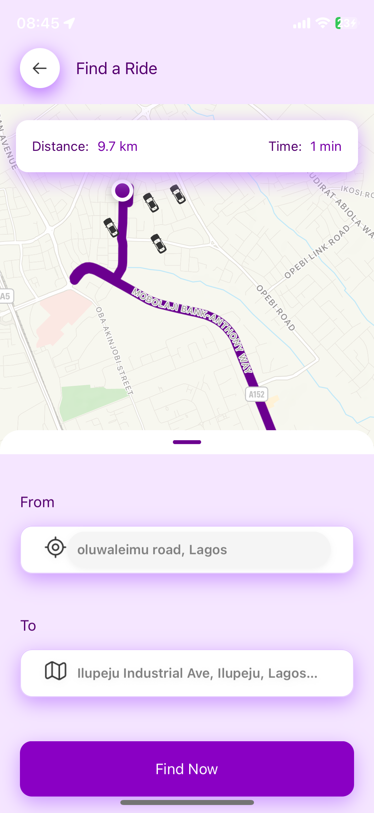</td>
      </tr>
      <tr>
        <td align="center">Find Ride Screen 1</td>
        <td align="center">Find Ride Screen 2</td>
      </tr>
    </table>

- **Select Ride Screens** (`app/(root)/book-ride.tsx`):
  - Description: Select driver and ride details.
  - Screenshots:
    <table>
      <tr>
        <td>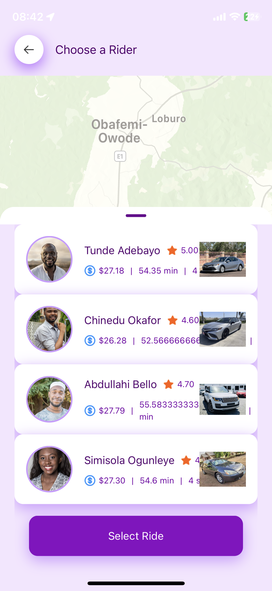</td>
        <td>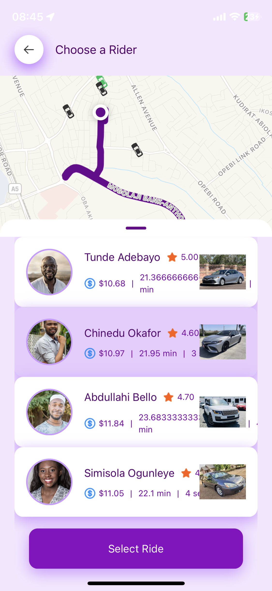</td>
      </tr>
      <tr>
        <td align="center">Select Ride Screen 1</td>
        <td align="center">Select Ride Screen 2</td>
      </tr>
    </table>

- **Confirm Ride Screen** (`app/(root)/confirm-ride.tsx`):
  - Description: Finalize ride with payment options.
  - Screenshot:
    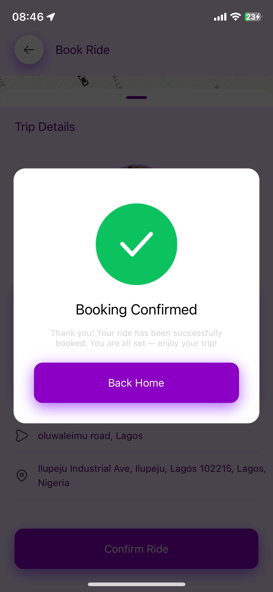

- **Payment Screen** (`components/Payment.tsx`):
  - Description: Interface for processing payments via Stripe.
  - Screenshot:
    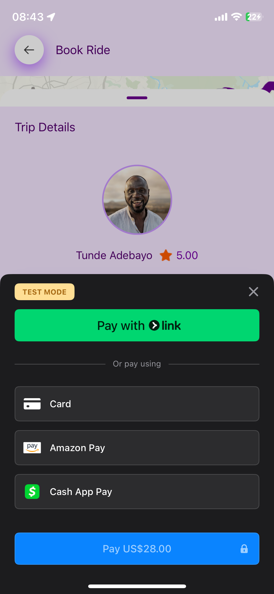


## Architecture and Diagrams

### UML Diagrams

- **Class Diagram**:
  - Description: Shows relationships between components (`CustomButton`, `InputField`, `Map`, etc.) and Clerk’s authentication classes.
  - Diagram:
    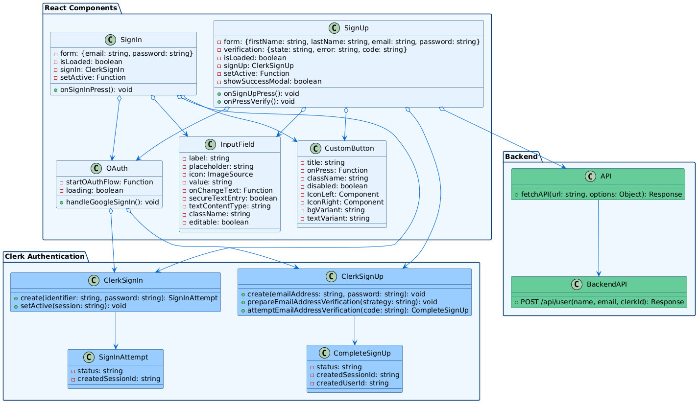

- **Component Diagram**:
  - Description: Illustrates app modules (auth, tabs, ride booking) and their interactions.
  - Diagram:
    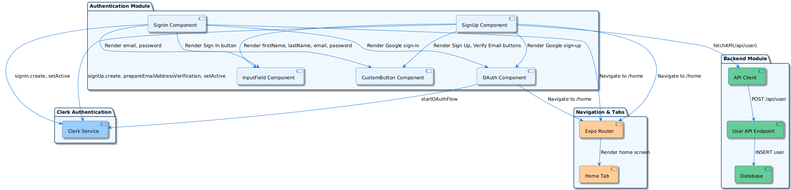

- **Sequence Diagram (Sign-In)**:
  - Description: Depicts the flow of email/password and Google OAuth sign-in with Clerk.
  - Diagram:
    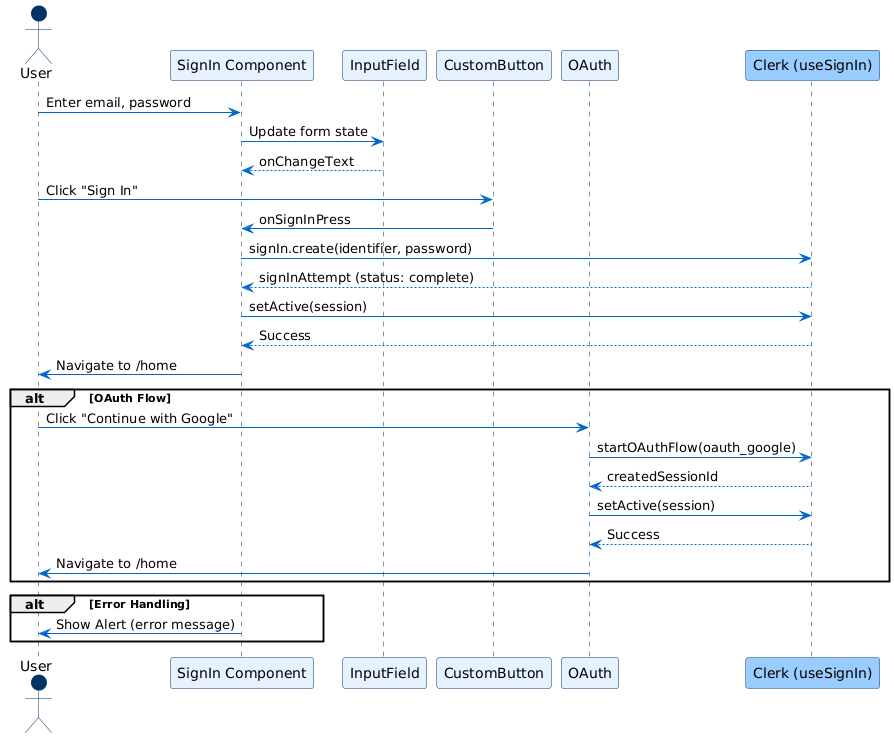

- **Sequence Diagram (Sign-Up)**:
  - Description: Depicts the flow of email/password sign-up with email verification.
  - Diagram:
    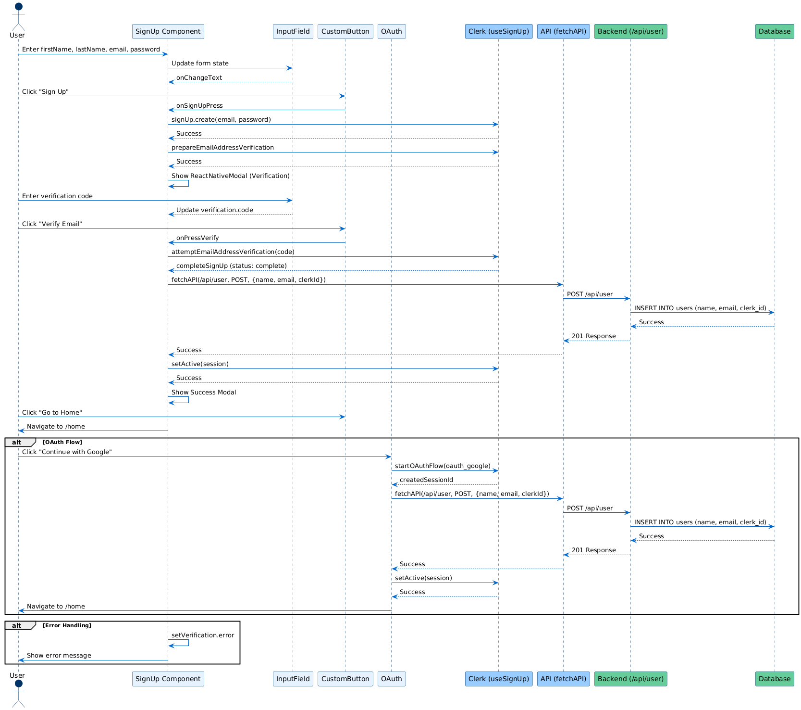

### Data Flow Diagrams

- **Level 0 DFD**:
  - Description: Shows data flow between User, App, Clerk, Google Maps, Stripe, and Neon.
  - Diagram:
    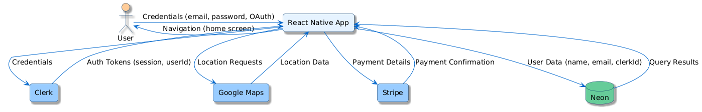

- **Level 1 DFD (Authentication)**:
  - Description: Details data flow for sign-in/up and OAuth processes.
  - Diagram:
    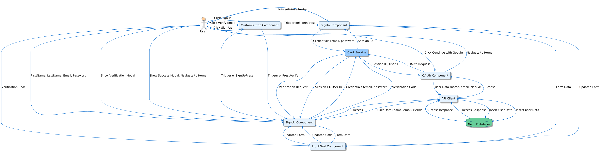

### System Diagrams

- **System Architecture**:
  - Description: Shows client (React Native app), serverless APIs (Expo Router), and external services (Clerk, Google Maps, Stripe, Neon).
  - Diagram:
    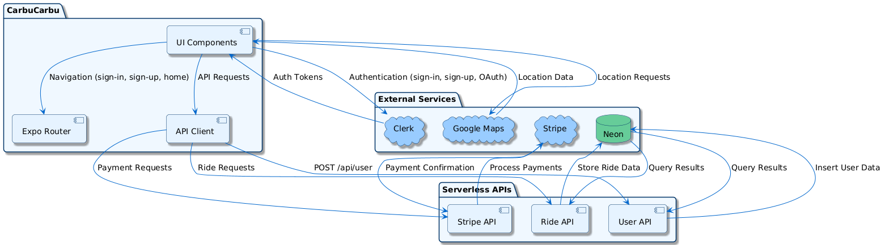


## Technologies Used

- **Frontend**:
  - React Native: v0.79.5
  - Expo: ^53.0.19
  - Expo Router: ~5.1.4
  - NativeWind: ^2.0.11 (Tailwind CSS)
  - React Native Reanimated: ~3.17.4
  - React Native Gesture Handler: ~2.24.0
  - React Native Modal: ^13.0.1
  - React Native Maps: 1.20.1
  - React Native Maps Directions: ^1.9.0
  - React Native Google Places Autocomplete: 2.5.1
  - React Native Linear Gradient: ^2.8.3
  - React Native Swiper: ^1.6.0
  - React Native Swiper Flatlist: ^3.2.3
  - React Native Keyboard Aware ScrollView: ^2.1.0
  - React Native Safe Area Context: 5.4.0
  - React Native Screens: ~4.11.1
  - React: 19.0.0
  - React DOM: 19.0.0
  - React Native Web: ^0.20.0
- **Authentication**:
  - Clerk: ^2.14.9 (@clerk/clerk-expo)
  - Expo Auth Session: ~6.2.1
  - Expo Secure Store: ~14.2.3
  - Expo Linking: ~7.1.7
  - Expo Local Authentication: ~16.0.5
- **APIs and Services**:
  - Google Maps API: For location services (via `react-native-maps`, `react-native-google-places-autocomplete`)
  - Stripe API: For payments (via `@stripe/stripe-react-native` 0.45.0, `stripe` ^16.7.0)
  - Neon Database: @neondatabase/serverless (^0.9.4)
- **Expo Plugins and Modules**:
  - Expo Font: ~13.3.2
  - Expo Linear Gradient: ^14.1.5
  - Expo Location: ~18.1.6
  - Expo Splash Screen: ~0.30.10
  - Expo Status Bar: ~2.2.3
  - Expo System UI: ~5.0.10
  - Expo Web Browser: ~14.2.0
  - Expo Constants: ~17.1.7
  - Expo Vector Icons: ^14.1.0
- **State Management**:
  - Zustand: ^4.5.4
- **Utilities**:
  - AJV: ^8.17.1 (JSON schema validator)
  - @react-native-community/clipboard: ^1.5.1
  - @twotalltotems/react-native-otp-input: ^1.3.11
- **Build Tools**:
  - TypeScript: ~5.8.3
  - ESLint: ^9.0.0
  - Prettier: ^3.3.3
  - Jest: ^29.7.0
  - Jest Expo: ~51.0.3
  - Tailwind CSS: 3.3.2
  - @expo/metro-runtime: ~5.0.4
- **Fonts**:
  - PlusJakartaSans (Bold, Regular, etc.)

## Contributing

1. **Fork the Repository**:
   ```bash
   git clone https://github.com/oluwaseun-odufisan/CarbuCarbu.git
   ```
2. **Create a Branch**:
   ```bash
   git checkout -b feature/your-feature
   ```
3. **Make Changes**:
   - Follow ESLint and Prettier rules (`npm run lint`, `npm run format`).
   - Update tests if applicable.
4. **Commit and Push**:
   ```bash
   git add .
   git commit -m "Add your feature description"
   git push origin feature/your-feature
   ```
5. **Create a Pull Request**:
   - Submit a PR on GitHub with a clear description.

## Testing

### Unit Tests

- **Tools**: Jest, React Native Testing Library
- **Run**:
  ```bash
  npm test
  ```

### Manual Testing

- **Authentication**:
  - Test email/password and Google OAuth sign-in/up.
  - Verify email verification modal.
- **Navigation**:
  - Ensure tab navigation (home, rides, chat, profile) works.
  - Confirm no back buttons trigger sign-out.
- **Ride Booking**:
  - Test ride search, booking, and confirmation.
- **Profile**:
  - Verify user data display and logout.
- **Logs**:
  ```bash
  adb logcat | grep "error"
  ```

## Troubleshooting

- **Clerk Authentication Fails**:
  - Check `EXPO_PUBLIC_CLERK_PUBLISHABLE_KEY` in `.env`.
  - Verify Clerk dashboard settings.
  - If `form_param_unknown` error occurs for `firstName`/`lastName`, ensure Clerk is not expecting these fields in `signUp.create` (see `sign-up.tsx`).
- **Google Maps Not Loading**:
  - Ensure `EXPO_PUBLIC_GOOGLE_MAPS_API_KEY` is valid.
  - Enable Maps SDK in Google Cloud Console.
- **Neon Database Errors**:
  - Verify `DATABASE_URL` in `.env`.
  - Ensure `users` table schema:
    ```sql
    CREATE TABLE users (
      id SERIAL PRIMARY KEY,
      first_name VARCHAR(255) NOT NULL,
      last_name VARCHAR(255),
      email VARCHAR(255) NOT NULL,
      clerk_id VARCHAR(255) NOT NULL UNIQUE
    );
    ```
  - Update schema if needed:
    ```sql
    ALTER TABLE users
    DROP COLUMN IF EXISTS name,
    ADD COLUMN IF NOT EXISTS first_name VARCHAR(255) NOT NULL,
    ADD COLUMN IF NOT EXISTS last_name VARCHAR(255);
    ```
- **Navigation Errors**:
  - Log navigation calls:
    ```javascript
    console.log("Navigating to:", path); // In OAuth.tsx, auth.ts
    ```
- **Dependency Issues**:
  ```bash
  npx expo install --fix
  ```

## Contact

- **Author**: Oluwaseun Odufisan
- **Email**: oluwaseun.odufisan@gmail.com
- **Portfolio**: [Oluwaseun Odufisan](https://oluwaseun-odufisan.vercel.app)

## Appendix

### package.json

```json
{
  "name": "carbucarbu",
  "main": "expo-router/entry",
  "version": "1.0.0",
  "scripts": {
    "start": "expo start",
    "android": "expo start --android",
    "ios": "expo start --ios",
    "web": "expo start --web",
    "lint": "expo lint"
  },
  "dependencies": {
    "@clerk/clerk-expo": "^2.14.9",
    "@expo/metro-runtime": "~5.0.4",
    "@expo/vector-icons": "^14.1.0",
    "@gorhom/bottom-sheet": "^4.6.4",
    "@neondatabase/serverless": "^0.9.4",
    "@react-native-community/clipboard": "^1.5.1",
    "@react-navigation/native": "^7.1.6",
    "@stripe/stripe-react-native": "0.45.0",
    "@twotalltotems/react-native-otp-input": "^1.3.11",
    "ajv": "^8.17.1",
    "expo": "^53.0.19",
    "expo-auth-session": "~6.2.1",
    "expo-constants": "~17.1.7",
    "expo-font": "~13.3.2",
    "expo-linear-gradient": "^14.1.5",
    "expo-linking": "~7.1.7",
    "expo-local-authentication": "~16.0.5",
    "expo-location": "~18.1.6",
    "expo-router": "~5.1.4",
    "expo-secure-store": "~14.2.3",
    "expo-splash-screen": "~0.30.10",
    "expo-status-bar": "~2.2.3",
    "expo-system-ui": "~5.0.10",
    "expo-web-browser": "~14.2.0",
    "i": "^0.3.7",
    "nativewind": "^2.0.11",
    "react": "19.0.0",
    "react-dom": "19.0.0",
    "react-native": "0.79.5",
    "react-native-gesture-handler": "~2.24.0",
    "react-native-google-places-autocomplete": "2.5.1",
    "react-native-keyboard-aware-scrollview": "^2.1.0",
    "react-native-linear-gradient": "^2.8.3",
    "react-native-maps": "1.20.1",
    "react-native-maps-directions": "^1.9.0",
    "react-native-modal": "^13.0.1",
    "react-native-reanimated": "~3.17.4",
    "react-native-safe-area-context": "5.4.0",
    "react-native-screens": "~4.11.1",
    "react-native-swiper": "^1.6.0",
    "react-native-swiper-flatlist": "^3.2.3",
    "react-native-web": "^0.20.0",
    "stripe": "^16.7.0",
    "zustand": "^4.5.4"
  },
  "devDependencies": {
    "@babel/core": "^7.20.0",
    "@types/jest": "^29.5.12",
    "@types/react": "~19.0.10",
    "@types/react-test-renderer": "^18.0.7",
    "eslint": "^9.0.0",
    "eslint-config-expo": "~9.2.0",
    "eslint-config-prettier": "^9.1.0",
    "eslint-plugin-import": "^2.29.1",
    "eslint-plugin-prettier": "^5.2.1",
    "jest": "^29.7.0",
    "jest-expo": "~51.0.3",
    "prettier": "^3.3.3",
    "react-test-renderer": "19.0.0",
    "tailwindcss": "3.3.2",
    "typescript": "~5.8.3"
  },
  "private": true
}

```
